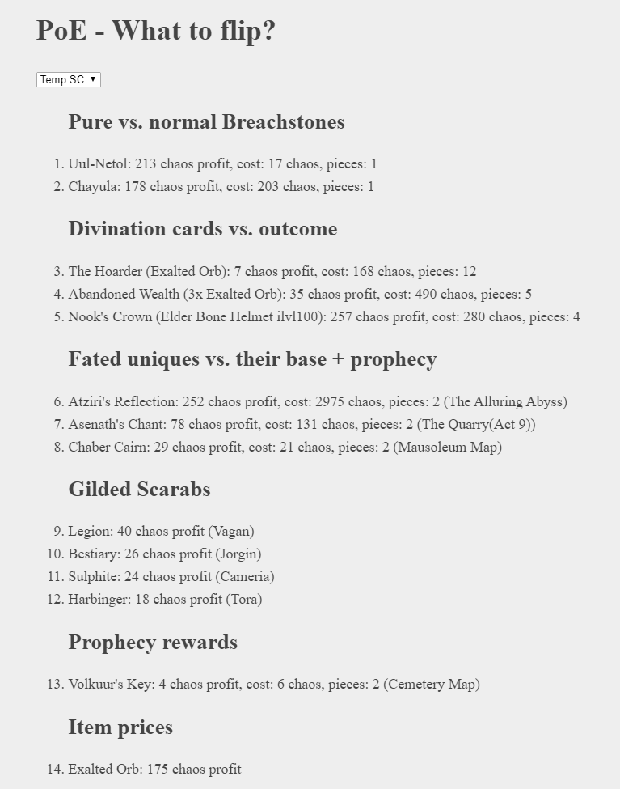

# PoE - What To Flip

#### Compares prices to find the most profitable deals (Divination Cards, Breachstones, Prophecies, Scarabs, anything)

https://codesandbox.io/s/github/5k-mirrors/poe-what-to-flip

### Usage

An editor where you can see the app (on the right) and edit the code (on the left):

https://codesandbox.io/s/github/5k-mirrors/poe-what-to-flip

- Wait a bit to let the data load.
- Extend [`config.js`](src/functions/config.js) with any custom comparison.
- Modify [`config.js`](src/functions/config.js) to use your own `proxy`. If too many users use the default proxy it won't be able to fetch the data anymore. No technical knowhow required to setup your own, free proxy: https://github.com/Rob--W/cors-anywhere
